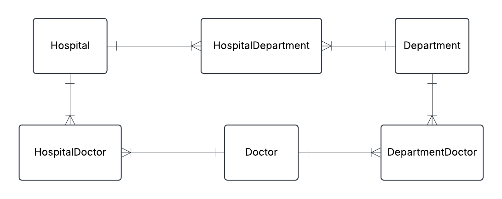
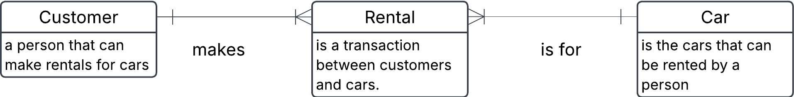

# Excercise 0

## 0. Convert a table data into json data

You have an SQL table that looks like this

```sql
CREATE TABLE Employees (
    employee_id INT PRIMARY KEY,
    first_name VARCHAR(50),
    last_name VARCHAR(50),
    department VARCHAR(50),
    salary INT
);

INSERT INTO Employees VALUES (1, 'Hakan', 'Hakansson', 'HR', 30000);
INSERT INTO Employees VALUES (2, 'Bob', 'Bobson', 'IT', 35000);
```

a) Start with writing out the table with the data

b) Convert this into semi-structured JSON format. Do it manually not programmatically.

### Solution

a)

| employee_id | first_name | address   | department | salary |
| ----------- | ---------- | --------- | ---------- | ------ |
| 1           | Hakan      | Hakansson | HR         | 30000  |
| 2           | Bob        | Bobson    | IT         | 35000  |

b)

```json
{
  "Employees": [
    {
      "employee_id": 1,
      "first_name": "Hakan",
      "address": "Hakansson",
      "department": "HR",
      "salary": 30000
    },
    {
      "employee_id": 2,
      "first_name": "Bob",
      "address": "Bobson",
      "department": "IT",
      "salary": 35000
    }
  ]
}
```

## 1. Convert json-file to tables - HOSPITAL TASK

You have this json data, convert it into three tables: Hospital, Department and Doctor. Fill these tables with data. Do this manually and not programmatically.

```json
{
  "hospital": "Sjukhusstock",
  "address": "Drottninggatan 3, Stockholm",
  "departments": [
    {
      "name": "Kardiologi",
      "doctors": [
        { "id": 1, "name": "Dr. Abra Abrahamson" },
        { "id": 2, "name": "Dr. Erika Eriksson" }
      ]
    },
    {
      "name": "Neurologi",
      "doctors": [{ "id": 3, "name": "Dr. Sven Svensson" }]
    }
  ]
}
```

### Solution

Approach

- identify entities
- identify relationships and cardinalities
- create conceptual ERD
- create tables

**Initial naive conceptual ERD**


&nbsp;

**Initial tables**

Hospital

| hospital_id | name         | address          |
| ----------- | ------------ | ---------------- |
| 1           | Sjukhusstock | Drottninggatan 3 |

Department

| department_id | name       |
| ------------- | ---------- |
| 1             | Kardiologi |
| 2             | Neurologi  |

Doctor

| doctor_id | name                |
| --------- | ------------------- |
| 1         | Dr. Abra Abrahamson |
| 2         | Dr. Erika Eriksson  |
| 3         | Dr. Sven Svensson   |

**Refined conceptual ERD with bridge tables to reflect many-to-many relationships**



---

HospitalDepartment

| hospital_department_id | hospital_id | department_id |
| ---------------------- | ----------- | ------------- |
| 1                      | 1           | 1             |
| 2                      | 1           | 2             |

HospitalDoctor

| hospital_doctor_id | hospital_id | doctor_id |
| ------------------ | ----------- | --------- |
| 1                  | 1           | 1         |
| 2                  | 1           | 2         |
| 3                  | 1           | 3         |

DepartmentDoctor

| department_doctor_id | department_id | doctor_id |
| -------------------- | ------------- | --------- |
| 1                    | 1             | 1         |
| 2                    | 1             | 2         |
| 3                    | 2             | 3         |

Test a join:
I want info on Sjukhusstock and its departments

- hospital_department can join with department table on department_id and hospital table on hospital_id
- query name from hospital table and name from department table

```sql
SELECT h.name AS hospital_name, d.name AS department_name
FROM main.Department d
INNER JOIN main.HospitalDepartment hd 
    ON d.department_id = hd.department_id 
INNER JOIN main.Hospital h
    ON h.hospital_id = hd.hospital_id 
WHERE h.name = 'Sjukhusstock';
```

---

## 2. Library Bookly

A library called Bookly keeps track of books and members who borrow them. Each book has a title, author, and ISBN number. Each member has a membership ID, name, and contact information. A member can borrow multiple books, but each book can be borrowed by only one member at a time.

a) Identify the entities and attributes for each entity.

b) Determine the relationship between member and books.

c) Draw a conceptual ERD using crow foots notation.

### Solution

a) Entities:

**Book**

- ISBN
- title
- author

> [!NOTE]
> ISBN is a unique number for a book, which could be used as a `primary key`, this will make it into a `natural key`

**Member**

- membership_id
- first_name
- last_name
- phone
- adress
- email

**Borrowing**

- borrowing_ID (Primary Key)
- ISBN (Foreign Key)
- membership_id (Foreigh Key)
- borrow_date
- return_date
-

b) Relationship between entities

- A Member cah have zero, one or several Borrowings
- A Borrowing can be made by one and only one Member
- A Borrowing is linked to one and only one Book
- A Book can be in zero, one or more Borrowings over time

c)

Initial conceptual ERD


<br>

Replaced many-to-many waith a bridge table (composite entity)


## 3. Conceptual ERD to words

This is an ERD conceptual diagram that a database designer and the business stakeholders agreed upon in a car rental company called Carent.


a) Describe the entities in this conceptual ERD.

b) Write out the relationship labels.

c) Describe the relationships between the entities (one-to-many, one-to-one and many-to-many).

d) Define the relationship statement for example: "A Customer can have one or more Rentals".

### Solution

a)

- Customer is a person that can make rentals for cars.

- Car is the cars that can be rented by a person/customer

- Rental (composite entity) is a transaction between customers and cars.

Alternative to put in descriptions into the entities directly in conceptual ERD



b) See image above

c)

- Customer to Rental (one-to-many)
- Rental to Customer (many-to-one)
- Rental to Car (many-to-one)
- Car to Rental (one-to-many)

d)

- Customer can have one or more Rentals over time
- Each rental is connected to one Customer
- Each Rental is for one Car
- Each Car can be in several Rentals

## 4. Online store
You are designing a database for an online store that sells multiple products. Customers can place multiple orders, and each order contains multiple products.

a) Identify entities and their relationships

b) Create a conceptual ERD with cardinalities

Table Representation:
- 1 Customer → M Orders (1:M)
- 1 Order → M Products (1:M via Order_Product)
- 1 Product → M Orders (1:M via Order_Product)

### Solution

a) 

**Customer**
- customer_id (Primary Key)
- first_name
- last_name
- email
- phone
- adress

**Product**
- product_id (Primary Key)
- name
- price
- stock_quantity

**Order**
- order_ID (Primary Key)
- customer_id (Foreign Key)
- order_date
- payment_status
- shipping_date

**Order_Product (Bridge Table)**
- order_product_ID (Primary Key)
- order_ID (Foreign Key)
- product_id (Foreign Key)
- quantity

Relationships:
- A customer can place multiple orders.
- An order belongs to one customer but contains multiple products.
- A product can be part of many orders.
- An order can have multiple products, and a product can be in multiple orders, we need a many-to-many (M:M) relationship table.

b) 

## 5. University management system

A university needs a system to manage students, courses, and professors:
- each student can enroll in multiple courses.
- each course is taught by one professor.
- a teacher can teach multiple courses.

a) Identify entities and their relationships

b) Come up with possible attributes for the entities

c) Draw conceptual ERD with cardinalities

d) Define business rules (e.g. a student can enroll in max 4 courses)

### Solution

c)
Conceptual ERD with cardinalities


