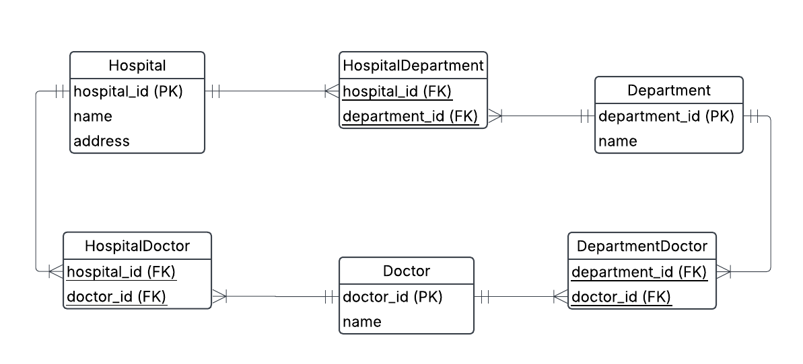

# Excercise 2

## 0. Ezecream orders

Our beloved ice cream company Ezecream has a Sales table that looks like this

| order_id | order_date | customer_id | customer_name  | customer_address | product_id | product_name | quantity |
| -------- | ---------- | ----------- | -------------- | ---------------- | ---------- | ------------ | -------- |
| 101      | 2024-04-05 | 05          | Ragnar Lodbrok | Kattegatt 3      | 3          | Blåbärsmagi  | 20       |
| 101      | 2024-04-05 | 05          | Ragnar Lodbrok | Kattegatt 3      | 5          | Lakritsdröm  | 15       |
| 101      | 2024-04-05 | 05          | Ragnar Lodbrok | Kattegatt 3      | 1          | Lichipichi   | 35       |
| 105      | 2025-01-10 | 15          | Feliz Fernadu  | Madridugatan 2   | 8          | Gitlass      | 30       |
| ...      | ...        | ...         | ...            | ...              | ...        | ...          | ...      |

a) Find different problems with this table, so that Ezecream will take you in for internship to fix it for them.

**ANSWER**
We could identify the following problems:

1. data redundancy

- Definition: same values repeated across multiple rows which leads to problems with data consistency and increased storage usage.
  Example: look order 101: name + address repeated 3 times.

2. insertion anomaly

- Definition: An insertion anomaly occurs when adding a new record is impossible or requires unnecessary data (depends on the constraints in the database).
- Example:A new customer cannot be added unless they have placed an order.

3. update anomaly

- Definition: updating/modifying a value in one row leads to inconsistencies with other rows. In other words one would have to update same info in several places.
- Example: If we need update name/address of a customer that is present in several rows, we would have to manually update it in each row linked to this customer or create inconsistent data.

4. deletion anomaly

- Definition: deletion of a record leads to unintentional loss of data. In other words: you remove data you wanted to remove PLUS data that you should have kept.
- Example: If a product is only stored in the Sales table and we delete the last order for that product, we lose all knowledge of that product.

---

b1) Does this table satisfy 1NF, 2NF? Motivate.

**ANSWER**

**checklist 1NF**
✅ row order doesn't matter
✅ Primary Key (PK) exists in each table
NOTE: We assume a composite key (order_id, product_id).
However, this prevents the same customer from adding the same product to an order with a different quantity.
✅ No repeting groups  
✅ Unifor column data (atomic values, one data type per attribute)

The table satisfies 1NF: all attributes are atomic and uniquely identified by the PK.

**checklist 2NF**
✅ 1NF is satisfied
🔴 Non prime attributes must be functionally dependent on entire PK,not just part of it:

- Problem: customer_name and customer_address depend only on customer_id,
  not on the full composite key (order_id, product_id).
- Conclusion: This means partial dependency exists, so the table violates 2NF and needs normalization.

**How to check the last step:**

- Identify the Primary Key (PK): (order_id, product_id).
- Identify non-key columns (columns not in the PK).
- Check if each non-key column fully depends on the entire PK.
- If any column depends only on part of the PK, then ❌ 2NF is not satisfied.

---

b2) Normalize this table to 3NF, make conceptual diagram and relational schema notation for each relation. Relational schema notation is `RelationName(attribute1, attribute2, ...)`

**ANSWER**
We should divide the Sales table into the following entities:

**Customer**

- customer_id (PK)
- customer_name
- customer_address

**Order**

- order_id (PK)
- order_date
- customer_id (FK → Customer)

**Product**

- product_id (PK)
- product_name

**Order_Detail**

- Composite primary key (order_id, product_id), (PK)
- order_id (PK, FK → Order)
- product_id (PK, FK → Product)
- quantity

**conceptual ERD**


**_Relationel schema notation_**

- Customer(customer_id, customer_name, customer_address)
- Product(product_id, product_name)
- Order(order_id, order_date, customer_id)
- Order_Detail(order_id, product_id, quantity)
  (PK: (order_id, product_id), FK: order_id → Order, product_id → Product)

---

c) Now also add price attribute. Think about what would happen when price increases or decreases.
**ANSWER**

The outcome is different, depending where we add the price attribute.
Possible solutions are:

- A: Store price in the Product table.
  Works well if prices never change.
  Problem: If prices increase or decrease, historical orders would be incorrect because they would always show the latest price instead of the original purchase price.

- B: Store price in Order_Detail.
  Best approach if prices change over time, as it ensures that each order keeps the price valid at the time of purchase.
  Works well for: Tracking historical sales correctly.

- C: Create a separate Price_List entity.
  Why? If you need to keep track of historical price changes separately, you can store price updates in a dedicated table.
  Implementation:
- Price_List(product_id (PK, FK → Product), price, update_date (PK))
  Stores all historical prices.
- Order_Detail(order_id, product_id, quantity, price) (stores price at purchase time)
  Advantage: This structure allows both tracking old orders correctly and keeping a history of past prices.

### NOTE:

- price in Price_List = Historical price of a product on a certain date

  | product_id | price | update_date |
  | ---------- | ----- | ----------- |
  | 3          | 10.00 | 2024-01-01  |
  | 3          | 12.50 | 2024-06-01  |
  | 5          | 8.00  | 2024-03-15  |

- price in Order_Detail = Final price at the time of purchase

  | order_id | product_id | price | quantity |
  | -------- | ---------- | ----- | -------- |
  | 101      | 3          | 10.00 | 1        |
  | 102      | 3          | 12.50 | 2        |
  | 103      | 5          | 8.00  | 4        |

---

d) Write SQL code to get the total price for Ragnar Lodbrok.
Insert data into your tables and test it out.

```sql
SELECT 
    ods.order_id AS order_id,
    SUM(det.quantity * det.price_sek ) AS price_per_order,
    cus.customer_name AS customer_name
FROM ex2_ezecream.orders ods
LEFT JOIN ex2_ezecream.customer cus
    ON ods.customer_id = cus.customer_id
LEFT JOIN ex2_ezecream.order_detail det
    ON det.order_id = ods.order_id
WHERE cus.customer_name = 'Ragnar Lodbrok'
GROUP BY ods.order_id,cus.customer_name;
```
---

## 1. Sakila

Use the same ERD from Sakila as in exercise1 task 3.

a) Is this normalized to 3NF?

b) Lets zoom in to the inventory, explain how it works for tracking films in each stores.

c) Do we have a way to know if a film is rented out or not?

---

## 2. Revisiting the doctor example

Remember the doctor, hospital and department example from exercise0 and exercise1.

a) Does the design fulfill 3NF, motivate based on the rules for the normal forms.

**ANSWER**



First Normal Form (1NF):
✅ Each column must have atomic values (no multiple values in one column).
✅ Each row must be uniquely identifiable (i.e., have a primary key).
✅ Each column must contain only a single type of data.

Second Normal Form (2NF):
✅ The table is in 1NF.
✅ No partial dependency: Every non-key attribute must be fully dependent on the entire primary key (not just part of it).

WHY?
- The HospitalDepartment, HospitalDoctor, and DepartmentDoctor tables use composite primary keys, and all non-key attributes depend on the full key.
- No column is only dependent on part of the primary key.

Third Normal Form (3NF):
✅ The table is in 2NF.
✅ No transitive dependencies: Non-key attributes should only depend on the primary key and not on another non-key attribute.

WHY?
- There are no transitive dependencies.
- All non-key attributes (e.g., hospital name, department name, doctor name) only depend on their respective primary keys.
- The many-to-many relationship tables (HospitalDepartment, HospitalDoctor, and DepartmentDoctor) only contain foreign keys, which is expected in 3NF.

***Conclusion***
Yes, the hospital schema fulfills 3NF!
Each table is in 1NF, 2NF, and 3NF, with:
- no redundant data
- no partial dependencies
- no transitive dependencies, for example:
  - In HospitalDoctor, the only attribute is {hospital_id, doctor_id} → fully dependent on the composite key 
  - In DepartmentDoctor, the only attribute is {department_id, doctor_id} → fully dependent on the composite key

***NOTE:***
Although the schema formally meets 3NF, it doesn't correctly model the real-world relationships:
- A doctor can work in multiple hospitals.
- A doctor can work in multiple departments.
- But we don’t know which department a doctor works in at a specific hospital.

b) You should have realised from this question in exercise1 0e)

> "Create a few tables manually, insert given data plus some more, and try to manually link foreign keys to primary keys. 
Can you satisfy that a doctor can work at `several departments and several hospitals?`"

that this creates ambiguity. This can be solved with a ternary relationship, which connects three entities simultaneously. Now make a new iteration for this data model.

**ANSWER**
In folder `ex1_1_hospital` there is a file `migrate_data_to_alternative_schema.psql` that creates schema with the following tables:

Hospital

| hospital_id | name         | address          |
| ----------- | ------------ | ---------------- |
| 1           | Sjukhusstock | Drottninggatan 3 |
| 2           | Sjukhussoder | Sodergatan 3     |

Department

| department_id | name       |
| ------------- | ---------- |
| 1             | Kardiologi |
| 2             | Neurologi  |
| 3             | Gynekologi |

Doctor

| doctor_id | name                |
| --------- | ------------------- |
| 1         | Dr. Abra Abrahamson |
| 2         | Dr. Erika Eriksson  |
| 3         | Dr. Sven Svensson   |
| 4         | Dr. Carl Carlsson   |
| 5         | Dr. Anna Karlsson   |
| 6         | Dr. Sara Lindgren   |

DoctorDepartmentHospital

| doctor_id | department_id | hospital_id |
| --------- | ------------- | ----------- |
| 1         | 1             | 1           |
| 1         | 1             | 2           |
| 2         | 2             | 1           |
| 3         | 2             | 1           |
| 3         | 2             | 2           |
| 4         | 2             | 2           |
| 5         | 3             | 2           |
| 6         | 3             | 2           |
| 6         | 1             | 1           |

Which follows the following ERD:

c) In your design do you have bridge tables as well in addition to the ternary relationship. Motivate why you should or should not have them.
