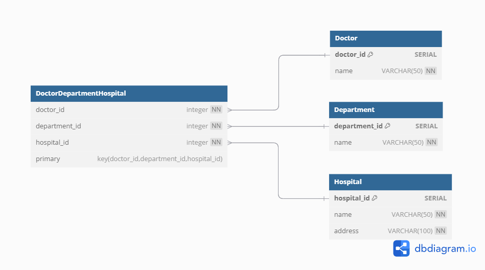

# Excercise 2

## 2. Revisiting the doctor example

Remember the doctor, hospital and department example from exercise0 and exercise1.

a) Does the design fulfill 3NF, motivate based on the rules for the normal forms.

**ANSWER**

First Normal Form (1NF): 
✅ Each column must have atomic values (no multiple values in one column). 
✅ Each row must be uniquely identifiable (i.e., have a primary key). 
✅ Each column must contain only a single type of data. 

Second Normal Form (2NF): 
✅ The table is in 1NF. 
✅ No partial dependency: Every non-key attribute must be fully dependent on the entire primary key (not just part of it). 

WHY?

- The HospitalDepartment, HospitalDoctor, and DepartmentDoctor tables use composite primary keys, and all non-key attributes depend on the full key (3NF trivially)
- No column is only dependent on part of the primary key.

hospital_id -> name, address (depends on the address, if in the field address we put together: street, no, city, postal code) 
department_id -> name
doctor_id -> name 

Third Normal Form (3NF): 
✅ The table is in 2NF. 
✅ No transitive dependencies: Non-key attributes should only depend on the primary key and not on another non-key attribute. 

WHY?

- There are no transitive dependencies.
- All non-key attributes (e.g., hospital name, department name, doctor name) only depend on their respective primary keys.
- The many-to-many relationship tables (HospitalDepartment, HospitalDoctor, and DepartmentDoctor) only contain foreign keys, which is expected in 3NF.

**_Conclusion_**
Yes, the hospital schema fulfills 3NF!
Each table is in 1NF, 2NF, and 3NF, with:

- no redundant data
- no partial dependencies
- no transitive dependencies, for example:
  - In HospitalDoctor, the only attribute is {hospital_id, doctor_id} → fully dependent on the composite key
  - In DepartmentDoctor, the only attribute is {department_id, doctor_id} → fully dependent on the composite key

**_NOTE:_**
Although the schema formally meets 3NF, it doesn't correctly model the real-world relationships:

- A doctor can work in multiple hospitals.
- A doctor can work in multiple departments.
- But we don’t know which department a doctor works in at a specific hospital.

b) You should have realised from this question in exercise1 0e)

> "Create a few tables manually, insert given data plus some more, and try to manually link foreign keys to primary keys.
> Can you satisfy that a doctor can work at `several departments and several hospitals?`"

that this creates ambiguity. This can be solved with a ternary relationship, which connects three entities simultaneously. Now make a new iteration for this data model.

**ANSWER**
In folder `ex1_1_hospital` there is a file `migrate_data_to_alternative_schema.psql` that creates schema with the following tables:

Hospital

| hospital_id | name         | address          |
| ----------- | ------------ | ---------------- |
| 1           | Sjukhusstock | Drottninggatan 3 |
| 2           | Sjukhussoder | Sodergatan 3     |

Department

| department_id | name       |
| ------------- | ---------- |
| 1             | Kardiologi |
| 2             | Neurologi  |
| 3             | Gynekologi |

Doctor

| doctor_id | name                |
| --------- | ------------------- |
| 1         | Dr. Abra Abrahamson |
| 2         | Dr. Erika Eriksson  |
| 3         | Dr. Sven Svensson   |
| 4         | Dr. Carl Carlsson   |
| 5         | Dr. Anna Karlsson   |
| 6         | Dr. Sara Lindgren   |

DoctorDepartmentHospital

| doctor_id | department_id | hospital_id |
| --------- | ------------- | ----------- |
| 1         | 1             | 1           |
| 1         | 1             | 2           |
| 2         | 2             | 1           |
| 3         | 2             | 1           |
| 3         | 2             | 2           |
| 4         | 2             | 2           |
| 5         | 3             | 2           |
| 6         | 3             | 2           |
| 6         | 1             | 1           |

Which follows the following ERD:

c) In your design do you have bridge tables as well in addition to the ternary relationship. Motivate why you should or should not have them.

#### Comparison: Keeping All Bridge Tables vs. Using Only `DoctorDepartmentHospital`

| Approach                                                                                                                | Pros                                                                                                                                                                                                         | Cons                                                                                                                                                                                  |
| ----------------------------------------------------------------------------------------------------------------------- | ------------------------------------------------------------------------------------------------------------------------------------------------------------------------------------------------------------ | ------------------------------------------------------------------------------------------------------------------------------------------------------------------------------------- |
| **Using Only `DoctorDepartmentHospital`**                                                                               | - Simpler schema with a single table for relationships.   - Eliminates redundancy and unnecessary tables.   - More normalized design.                                                                  | - Queries become more complex.   - Harder to extract information like "all doctors in a hospital" or "all departments in a hospital."   - Potential data redundancy in queries. |
| **Keeping All Bridge Tables (`HospitalDoctor`,  `DepartmentDoctor`, `HospitalDepartment`) + `DoctorDepartmentHospital`** | - Easier querying (e.g., listing all doctors at a hospital without worrying about departments).   - More flexible for tracking relationships.   - Easier updates without affecting unrelated entities. | - Requires more storage.   - Higher risk of data inconsistency if relationships are not properly managed.   - Adds complexity to schema management.                             |

### **Recommendation**

- In order to model **doctors working in specific departments at specific hospitals**, **`DoctorDepartmentHospital` is enough**.
- In order to use **flexible queries** (e.g., listing all doctors in a hospital regardless of department), keeping **bridge tables as well** is a better option.
