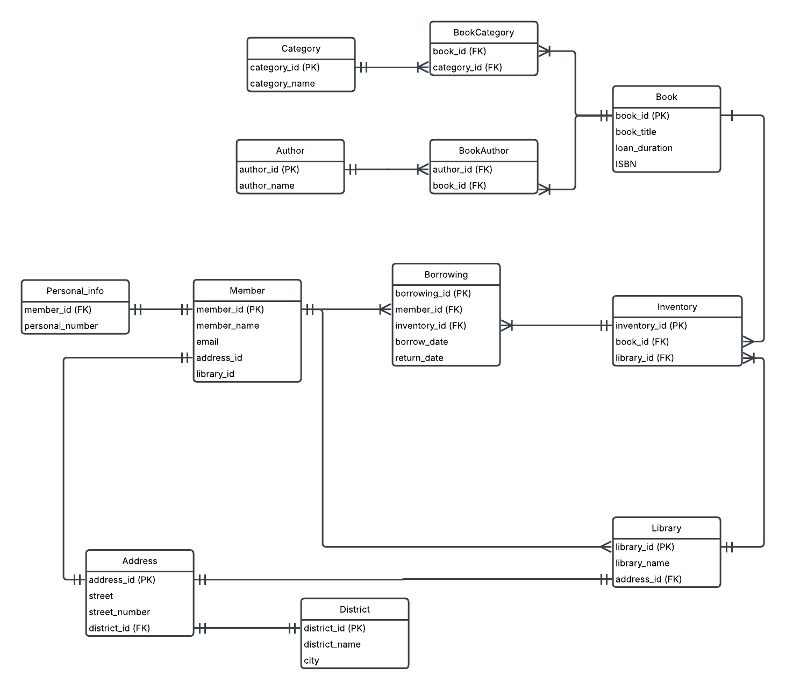

### 3. Library
Task:
- A library system have members, a way to borrow books.
- There are several libraries that have books in their inventory.
- Also keep track of authors for the books.
- Libraries can also be in different "stadsdelar" (city districts OR simply districs).

### Solution:
Here is an initial, logical ERD diagram for the library:
https://lucid.app/lucidchart/839938a4-9034-4347-8ac3-cf80b23ee55f/edit?invitationId=inv_9c3dd72d-0e65-45b5-89f4-70c2afc098ff&page=0_0#

#### Entities 

**Member** 
- **_member_id_** (PK)
- member_name
- email 
- address_id 
- library_id 

**Personal_info** 
- ***personal_number*** (PK)
- member_id (FK) 

**Address**
- ***address_id*** (PK) 
- street 
- street_number 
- district_id (FK)

**District** 
- ***district_id*** (PK) 
- district_name
- city

**Library**
- ***library_id*** (PK) 
- library_name 
- address_id (FK)

**Inventory**
- ***inventory_id*** (PK) 
- book_id (FK) 
- library_id (FK) 

**Borrowing** 
- ***borrowing_id*** (PK)
- member_id (FK) 
- inventory_id (FK) 
- borrow_date 
- return_date 

**Book** 
- ***book_id*** (PK) 
- book_title 
- loan_duration 
- ISBN 

**Author** 
- ***author_id*** (PK) 
- author_name 

**BookAuthor** 
- author_id (FK) 
- book_id (FK) 

**Category** 
- ***category_id*** (PK) 
- category_name 

**BookCategory** 
- book_id (FK) 
- category_id (FK) 

## Problem:
Library - invertory relationship:
**Scenario A**
One inventory belongs to one library, in other words only the books that are physically present in the library can be borrowed.

**Scenario B**
The libraries have a shared inventory online, which means that the members can put a reservation on a book that is physically stored in another location and this book will be delivered to their local library where they can borrow it.

## NOTE
This logical ERD already supports both Scenario A and Scenario B because:
- Each **inventory_id** represents a specific physical book copy.
- Library & Inventory are linked, ensuring books belong to a single library.
- Borrowing references Inventory, controlling where books are borrowed from.

#### The actual behavior (performance & borrowing rules) is determined by constraints in the physical model:
- SQL constraints
- triggers
- business rules
rather than altering the logical design.

#### Key Differences Between Scenario A & B in the Physical Model

| Feature              | Scenario A (Physical Constraints)                          | Scenario B (Shared Inventory)                        |
|----------------------|---------------------------------------------------------|----------------------------------------------------|
| **Book Ownership**   | Each book copy is tied to a specific library (`Inventory.library_id`) | Books can be transferred or reserved from any library |
| **Borrowing Rules**  | Members can only borrow books from their registered library | Members can borrow from any library, possibly requiring a transfer |
| **Reservation System** | No reservation across libraries (only available books can be borrowed) | Reservation system required to request books from other libraries |
| **Performance Impact** | Simpler queries, faster lookups since books are location-specific | More complex logic for book reservations and transfers |

**How to Switch Between A & B?**
**Scenario A:** Enforce borrowing restrictions with constraints (e.g., triggers preventing cross-library borrowing).
**Scenario B:** Remove the same constraints, and introduce a reservation system that allows books to be moved between libraries.
NOTE again ERD remains the same, but how it functions is purely dependent on the business rules at the database level! 

## Library Database Schema Overview

District (district_id, district_name, city)
    └── 🏙️ Stores different city districts.

Address (address_id, street, street_number, district_id 🔗)
    └── 📍 Holds addresses for libraries and members.

Library (library_id, library_name, address_id 🔗)
    └── 🏛️ Represents different library locations.

Member (member_id, member_name, email, address_id 🔗, library_id 🔗)
    └── 👤 Stores library members.

Personal_info (personal_number, member_id 🔗)
    └── 🆔 Stores unique personal numbers of members.

Book (book_id, book_title, loan_duration, ISBN)
    └── 📖 Represents books available in the library.

Author (author_id, author_name)
    └── ✍️ Stores book authors.

BookAuthor (author_id 🔗, book_id 🔗)
    └── 🔗 Many-to-Many relationship between books & authors.

Category (category_id, category_name)
    └── 📂 Categorizes books into groups.

BookCategory (book_id 🔗, category_id 🔗)
    └── 🔗 Many-to-Many relationship between books & categories.

Inventory (inventory_id, book_id 🔗, library_id 🔗)
    └── 📦 Tracks individual book copies in each library.

Borrowing (borrowing_id, member_id 🔗, inventory_id 🔗, borrow_date, return_date)
    └── 📑 Tracks book borrowing, also acts as a reservation system.

**Relationships:**
- Address links to District (district_id).
- Library and Member link to Address (address_id).
- Member belongs to a Library (library_id).
- Personal_info links to Member (member_id).
- Inventory keeps track of book copies at different Libraries (library_id).
- Borrowing logs which Member borrows a specific Inventory item.
- BookAuthor and BookCategory manage Many-to-Many relationships.

